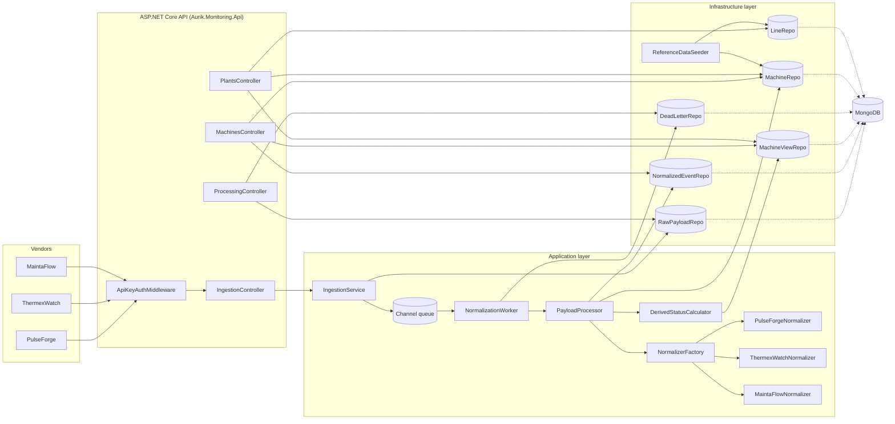
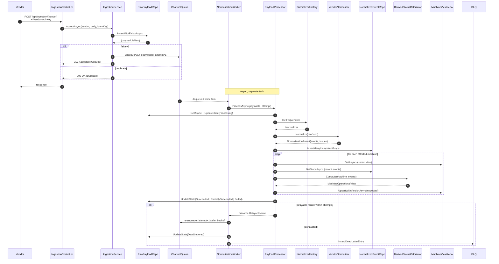

# Architecture

## Overview

## Sequence: vendor payload happy path

## Mongo collections and indexes

| Collection | Key indexes | Why |
| --- | --- | --- |
| `raw_payloads` | `ux_raw_idempotency` (unique on idempotencyKey), `ix_raw_state_received` | Idempotent ingestion + DLQ / status queries |
| `normalized_events` | `ux_event_idempotency` (unique on idempotencyKey), `ix_event_machine_time` | Dedup vendor events across retries; fast per-machine windowed queries |
| `machines` | `ux_machine_id` | Single-doc lookups |
| `lines` | `ux_line_plant_line` | Unique line key |
| `machine_views` | `ux_view_machine` (unique on machineId), `ix_view_plant_line` | View read paths |
| `dead_letters` | (implicit `_id`) | Inspection only — low write rate |
